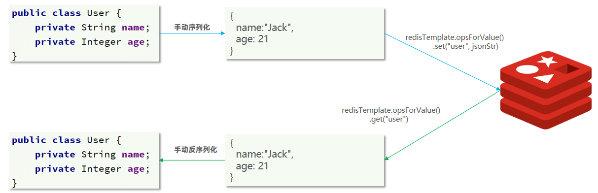
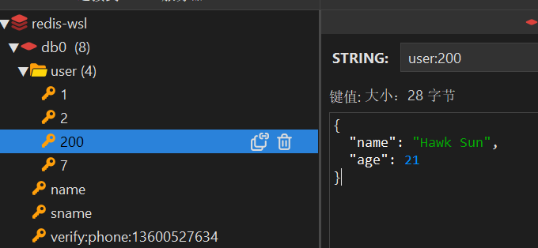

## 总体对比

1. Jedis
	- **同步阻塞**：Jedis 是基于阻塞 I/O 的客户端，所有操作都是同步的；在高并发场景下，需要通过连接池（如 Apache Commons Pool）管理多个连接来提高性能。
	- **线程不安全：** Jedis 实例本身不是线程安全的，因此在多线程环境中必须使用连接池
	- 以Redis命令作为方法名称，学习成本低，但没有提供高级特性（分布式锁，分布式集合等）

2. Lettuce
	- Lettuce 是一个基于 Netty 的 Redis 客户端，支持异步、响应式编程模型。
	- **非阻塞IO**：使用 Netty 实现非阻塞 I/O，支持异步和响应式编程。单个连接可以处理多个请求，减少了连接池的依赖
	- 是线程安全的
	- 支持Redis的所有核心功能，包括集群模式，哨兵模式和管道操作。

3. Redission
	- 是一个基于Redis实现的分布式、可伸缩的Java数据结构集合。
	- 提供了丰富的分布式数据结构（如分布式锁、分布式队列、分布式集合等）
	- Redisson 支持同步、异步和响应式编程模型
	- 支持高级功能：如分布式锁（可重入锁，公平锁等）、分布式集合（Map，Set， List），发布/订阅模式，Lua脚本支持
	- 提供了与 Spring、Spring Boot 等框架的无缝集成


## Jedis

### 快速入门

Pom依赖：

直接使用jedis

连接池的方式使用：

## SpringDataRedis

SpringData是Spring中数据操作的模块，包含对各种数据库的集成，其中对Redis的集成模块就叫做 SpringDataRedis
> 官网地址：https://spring.io/projects/spring-data-redis

- 提供了对不同Redis客户端的整合（Lettuce和Jedis）
- 提供了RedisTemplate统一API来操作Redis
- 支持Redis的发布订阅模型
- 支持Redis哨兵和Redis集群
- 支持基于Lettuce的响应式编程(Lettuce之前实在es那里有)
- 支持基于JDK.JSON.字符串.Spring对象的数据序列化及反序列化
- 支持基于Redis的JDKCollection实现

SpringDataRedis中提供了RedisTemplate工具类，其中封装了各种对Redis的操作。并且将不同数据类型的操作API封装到了不同的类型中：

### 快速入门

这里遇到一个问题：
![[2-springbootStart.png]]

Java版本不能选8，可以把上面的 url 改为：`https://start.aliyun.com`

#### 导入依赖：

```xml
<dependency>  
    <groupId>org.springframework.boot</groupId>  
    <artifactId>spring-boot-starter-data-redis</artifactId>  
</dependency>  
  
<dependency>  
    <groupId>org.apache.commons</groupId>  
    <artifactId>commons-pool2</artifactId>  
</dependency>
```

#### 配置文件：

```yml
spring:
  redis:
    host: 192.168.200.130
    port: 6379
    password: 1234
    database: 0
    lettuce:
      pool:
        max-active: 8 #最大连接数
        max-idle: 8 #最大空闲连接
        min-idle: 0 #最小空闲连接
        max-wait: 100 #连接等待时间
```

#### 注入并使用

```java
@SpringBootTest  
class SprintDataDemoApplicationTests {  
  
    @Autowired  
    private RedisTemplate redisTemplate;  
  
    @Test  
    void testString() {  
        redisTemplate.opsForValue().set("name", "shlock");  
        Object name = redisTemplate.opsForValue().get("name");  
        System.out.println(name);  
    }  
  
}
```

![[2-opsForValue.png]]
可以看到这里参数可以传入对象，运行后，可以输出结果

### 序列化

此时我们使用redis-cli直接get name，发现是
![[2-客户端-get-name.png]]
客户端里查看刚插入的 name：
![[2-客户端-name.png]]

由于使用的是String-Object，value的值如果传入一个字符串或者其他类型的话，并没有序列化，就会造成以上情况 这是由于key和value会被当成对象，被redis底层的默认序列化方法：jdk序列化工具 `jdkSerializationRedisSerialliszer`
而它采用的是`objectOutputStream`(把java对象转成字节)

选中 `RedisSerializer` 按 `Ctrl+H`
![[2-客户端-redisSerializer.png]]

定义一个 RedisConfig类：
```java
@Configuration  
public class RedisConfig {  
  
    @Bean  
    public RedisTemplate<String, Object> redisTemplate(RedisConnectionFactory connectionFactory){  
        // 创建RedisTemplate对象  
        RedisTemplate<String, Object> template = new RedisTemplate<>();  
        // 设置连接工厂  
        template.setConnectionFactory(connectionFactory);  
        // 创建JSON序列化工具  
        GenericJackson2JsonRedisSerializer jsonRedisSerializer = new GenericJackson2JsonRedisSerializer();  
        // 设置Key的序列化  
        template.setKeySerializer(RedisSerializer.string());  
        template.setHashKeySerializer(RedisSerializer.string());  
        // 设置Value的序列化  
        template.setValueSerializer(jsonRedisSerializer);  
        template.setHashValueSerializer(jsonRedisSerializer);  
        // 返回  
        return template;  
    }  
}
```

测试类
```java
@SpringBootTest  
class SprintDataDemoApplicationTests {  
  
    @Autowired  
    private RedisTemplate<String, Object> redisTemplate;  
  
    @Test  
    void testString() {  
        redisTemplate.opsForValue().set("sname", "shlock");  
        Object name = redisTemplate.opsForValue().get("sname");  
        System.out.println(name);  
    }  
  
    @Test  
    void saveUser() {  
        User user = new User("shlock", 18);  
        redisTemplate.opsForValue().set("user:7", user);  
        // 获取数据并转为User  
        User userObj = (User) redisTemplate.opsForValue().get("user:7");  
        System.out.println(userObj);  
    }  
  
}
```

序列化对象效果：
![[2-客户端-序列化.png]]

从上图可以看到，Json序列化器会将类的class类型写入json结果中，存入Redis会带来额外的内存开销

### StringRedisTemplate

为了节省内存空间，我们不使用json序列化器来处理value，而是统一使用String序列化器，要求只存储String类型的key和value，当存储Java对象时，手动完成对象的序列化和反序列化



这种用法比较普遍，因此SpringDataRedis就提供了RedisTemplate的子类：`StringRedisTemplate`，它的key和value的序列化方式默认就是String方式，省去了我们自定义RedisTemplate的序列化方式的步骤，而是直接使用：

```java
@SpringBootTest
class RedisStringTests {

    @Autowired
    private StringRedisTemplate stringRedisTemplate;

    @Test
    void testString() {
        // 写入一条String数据
        stringRedisTemplate.opsForValue().set("verify:phone:13600527634", "124143");
        // 获取string数据
        Object name = stringRedisTemplate.opsForValue().get("name");
        System.out.println("name = " + name);
    }

    private static final ObjectMapper mapper = new ObjectMapper();

    @Test
    void testSaveUser() throws JsonProcessingException {
        // 创建对象
        User user = new User("Hawk Sun", 21);
        // 手动序列化
        String json = mapper.writeValueAsString(user);
        // 写入数据
        stringRedisTemplate.opsForValue().set("user:200", json);

        // 获取数据
        String jsonUser = stringRedisTemplate.opsForValue().get("user:200");
        // 手动反序列化
        User user1 = mapper.readValue(jsonUser, User.class);
        System.out.println("user1 = " + user1);
    }

}
```

再来看一看存储的数据




### RedisTemplate操作Hash类型


```java
@SpringBootTest
class RedisStringTests {

    @Autowired
    private StringRedisTemplate stringRedisTemplate;


    @Test
    void testHash() {
        stringRedisTemplate.opsForHash().put("user:400", "name", "虎哥");
        stringRedisTemplate.opsForHash().put("user:400", "age", "21");

        Map<Object, Object> entries = stringRedisTemplate.opsForHash().entries("user:400");
        System.out.println("entries = " + entries);
    }
}
```

