# 短信登陆


## 1. 导入黑马店铺项目


### 1.1 导入SQL

创建一个hmdp数据库，并执行给的sql脚本，要求MySQL版本在5.7及以上

这个库的时间有问题，我先改了，不知道后面会不会有问题：

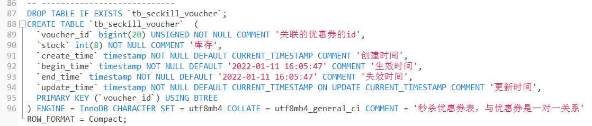

创建成功之后：

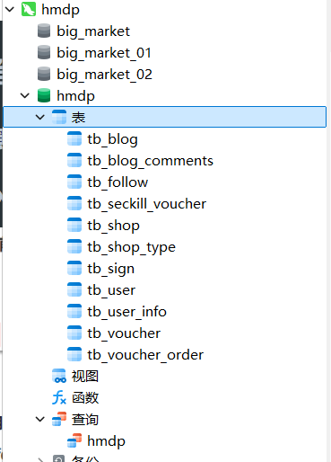


### 1.2 项目结构

手机或者app端发起请求，请求我们的nginx服务器，nginx基于七层模型走的事HTTP协议，可以实现基于Lua直接绕开tomcat访问redis，也可以作为静态资源服务器，轻松扛下上万并发， 负载均衡到下游tomcat服务器，打散流量，我们都知道一台4核8G的tomcat，在优化和处理简单业务的加持下，大不了就处理1000左右的并发， 经过nginx的负载均衡分流后，利用集群支撑起整个项目，同时nginx在部署了前端项目后，更是可以做到动静分离，进一步降低tomcat服务的压力，这些功能都得靠nginx起作用，所以nginx是整个项目中重要的一环。

在tomcat支撑起并发流量后，我们如果让tomcat直接去访问Mysql，根据经验Mysql企业级服务器只要上点并发，一般是16或32 核心cpu，32 或64G内存，像企业级mysql加上固态硬盘能够支撑的并发，大概就是4000起~7000左右，上万并发， 瞬间就会让Mysql服务器的cpu，硬盘全部打满，容易崩溃，所以我们在高并发场景下，会选择使用mysql集群，同时为了进一步降低Mysql的压力，同时增加访问的性能，我们也会加入Redis，同时使用Redis集群使得Redis对外提供更好的服务。

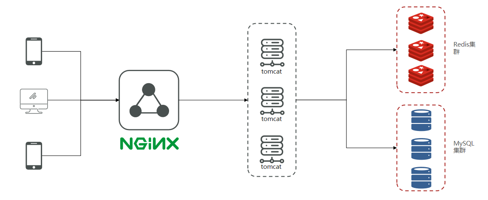


### 1.3 启动后端

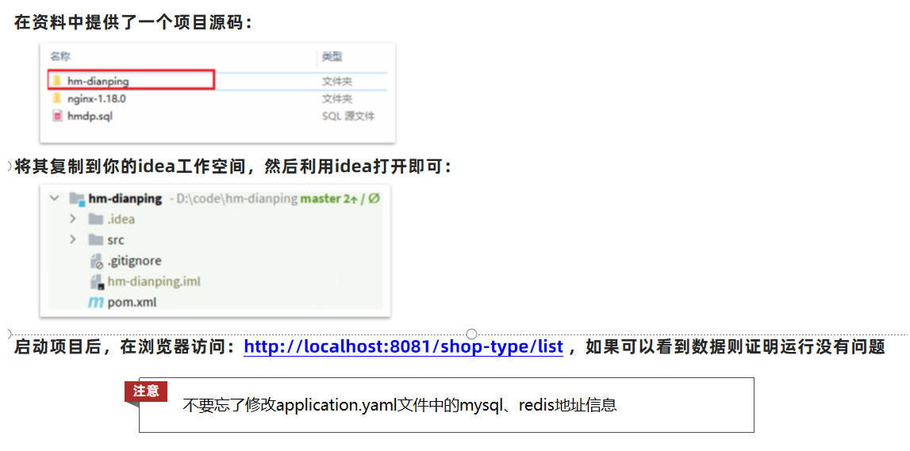

这里端口冲突了，改成了8088

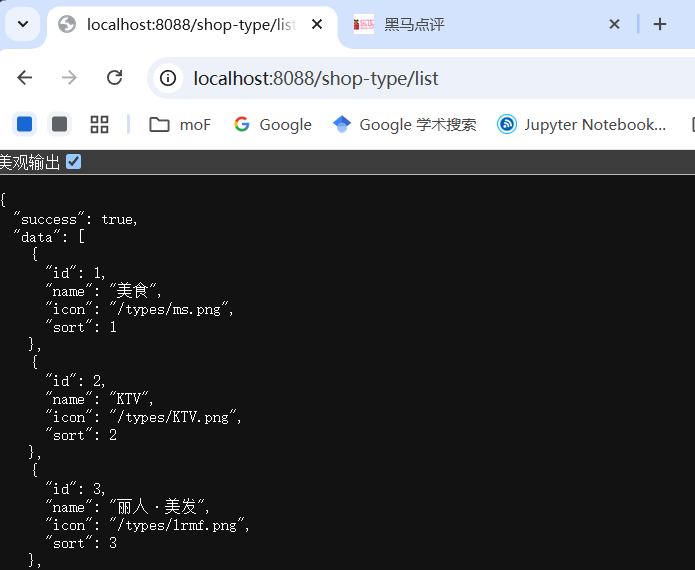


相对应的需要改一下前端nginx服务器，把前端的请求转发到 http://127.0.0.1:8088/xxx

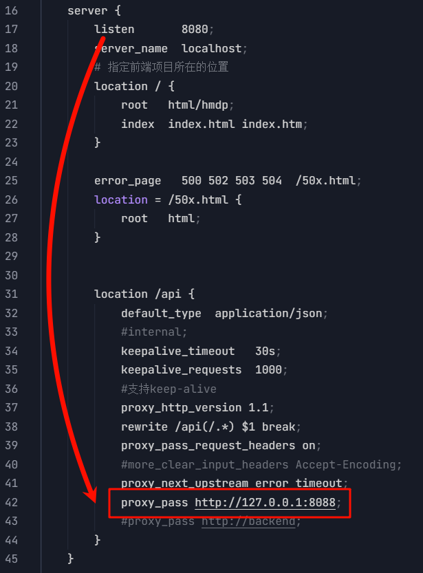

> 请求流程：
>
> - 浏览器发送请求到 http://localhost:8080/api/xxx
> - Nginx 接收到请求后，去掉 /api 前缀
> - 然后转发到 http://127.0.0.1:8088/xxx


### 1.4 导入前端

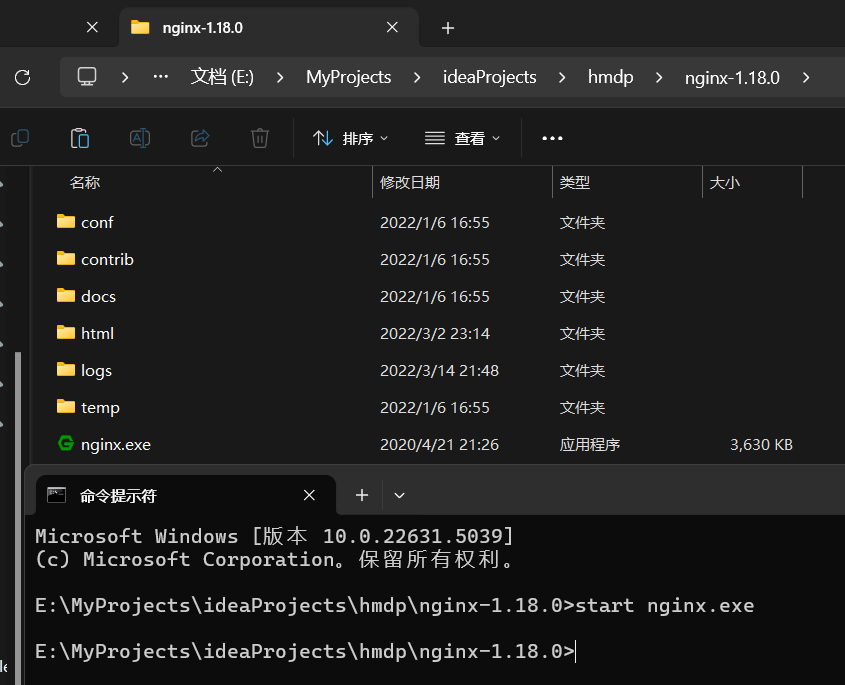

启动nginx后访问 http://127.0.0.1:8080/login.html ，并打开手机模式（右键->检查->左上角手机模式）

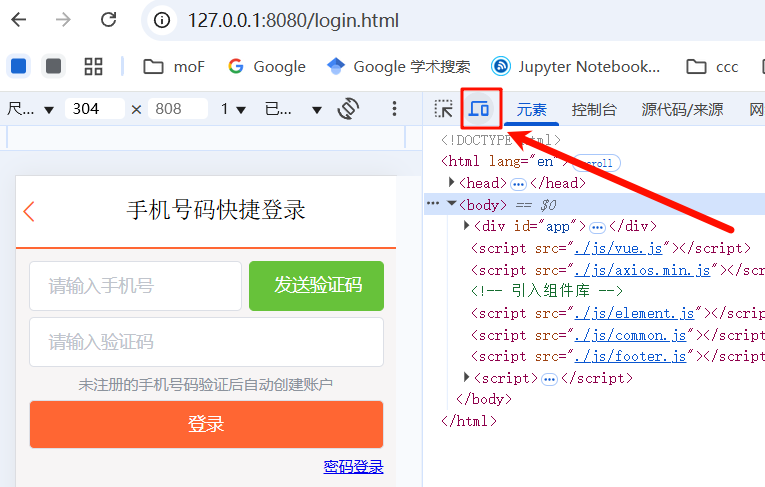


## 2. 基于Session实现登录流程

**发送验证码：**

用户在提交手机号后，会校验手机号是否合法，如果不合法，则要求用户重新输入手机号

如果手机号合法，后台此时生成对应的验证码，同时将验证码进行保存，然后再通过短信的方式将验证码发送给用户

**短信验证码登录、注册：**

用户将验证码和手机号进行输入，后台从session中拿到当前验证码，然后和用户输入的验证码进行校验，如果不一致，则无法通过校验，如果一致，则后台根据手机号查询用户，如果用户不存在，则为用户创建账号信息，保存到数据库，无论是否存在，都会将用户信息保存到session中，方便后续获得当前登录信息

**校验登录状态:**

用户在请求时候，会从cookie中携带者JsessionId到后台，后台通过JsessionId从session中拿到用户信息，如果没有session信息，则进行拦截，如果有session信息，则将用户信息保存到threadLocal中，并且放行


> `ThreadLocal`是一个线程域对象，在我们的业务中，每一个请求到达微服务都是一个独立的线程，如果没有用ThreadLocal，直接把用户保存到一个本地变量，就有可能出现多线程环境下的并发修改安全问题。而将用户保存在ThreadLocal中，它会在每一个线程的内部创建一个Map将数据保存，这样每一个线程都有自己独立的存储空间，与其他请求线程相互之间没有干扰，实现了线程隔离的效果。


### Session的补充知识

### 什么是 Session？

**Session**（会话）是计算机科学和网络技术中的一个重要概念，通常用于描述客户端与服务器之间的一次交互过程。它主要用于在无状态的 HTTP 协议中维护用户的状态信息，从而实现跨多个请求的上下文管理。

---

#### 核心概念

1. **HTTP 是无状态的**
   - HTTP 协议本身是无状态的，这意味着每次客户端向服务器发送请求时，服务器都无法知道这个请求是否与之前的请求有关联。
   - 为了在多次请求之间保持用户的登录状态、购物车内容或其他个性化数据，就需要一种机制来“记住”用户的状态，这就是 Session 的作用。

2. **Session 的基本原理**
   - 当用户首次访问服务器时，服务器会为该用户创建一个唯一的 **Session ID**，并将其存储在服务器端（例如内存、数据库或文件系统中）。
   - 这个 Session ID 通常通过 Cookie 或 URL 重写的方式返回给客户端。
   - 客户端在后续请求中携带这个 Session ID，服务器根据 ID 找到对应的 Session 数据，从而识别用户身份并恢复之前的上下文。

3. **Session 的生命周期**
   - **创建**：当用户首次访问某个需要会话的应用时，服务器会创建一个新的 Session。
   - **使用**：在用户与应用交互的过程中，服务器会根据 Session ID 检索和更新 Session 数据。
   - **销毁**：当用户退出登录、会话超时或管理员手动清除时，Session 会被销毁。

---

#### Session 的实现方式

1. **基于 Cookie**
   - 最常见的实现方式是通过 Cookie 存储 Session ID。服务器在响应中设置一个名为 `session_id` 的 Cookie，客户端在后续请求中自动携带该 Cookie。
   - 优点：简单易用，开发成本低。
   - 缺点：如果用户禁用了 Cookie，这种方式将无法工作。

2. **基于 URL 重写**
   - 如果客户端禁用了 Cookie，可以将 Session ID 作为参数附加到 URL 中（如 `http://example.com/?session_id=abc123`）。
   - 优点：不依赖 Cookie，兼容性更强。
   - 缺点：URL 中暴露了 Session ID，可能存在安全隐患；且 URL 管理变得复杂。

3. **基于 Token（JWT 等）**
   - 在现代 Web 应用中，尤其是 RESTful API 和单页应用（SPA），常使用基于 Token 的认证机制（如 JWT）。Token 包含了用户的身份信息，并通过加密签名保证安全性。
   - 优点：无需在服务器端存储 Session 数据，适合分布式系统。
   - 缺点：Token 一旦签发，无法立即撤销，必须等待过期。

---

#### Session 的优点

- **安全性较高**：Session 数据存储在服务器端，客户端只持有 Session ID，降低了敏感数据泄露的风险。
- **灵活性强**：可以根据需求在服务器端动态更新 Session 数据。
- **支持复杂场景**：适用于需要维护多种状态信息的场景，如购物车、登录状态等。

---

#### Session 的缺点

- **服务器资源消耗**：每个用户的 Session 数据都需要占用服务器内存或其他存储资源，可能会增加服务器的负担。
- **扩展性问题**：在分布式系统中，多个服务器需要共享 Session 数据，增加了复杂性（可以通过 Redis 等集中式存储解决）。
- **依赖客户端行为**：如果客户端清除了 Cookie 或丢失了 Session ID，会导致会话中断。

---

#### Session 与 Cookie 的区别

| **特性**         | **Session**                                   | **Cookie**                                  |
|-------------------|-----------------------------------------------|---------------------------------------------|
| **存储位置**     | 服务器端                                      | 客户端                                      |
| **安全性**       | 较高（仅传递 Session ID）                     | 较低（可能被篡改或窃取）                    |
| **存储容量**     | 取决于服务器性能                              | 每个 Cookie 最大 4KB                        |
| **生命周期**     | 随 Session 销毁而结束                        | 可设置过期时间                              |
| **适用场景**     | 用户状态管理（如登录、购物车）                | 小型数据存储（如用户偏好设置）              |

---


## 3. 实现短信验证码登陆和注册功能

登陆流程：

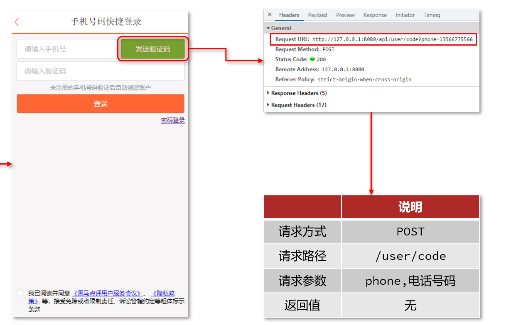


### 3.1 发送验证码

在`UserService`接口注册新的方法并在`UserServiceImpl`实现：

```java
Result sendCode(String phone, HttpSession session);
```

`UserServiceImpl`实现：

```java
@Override
public Result sendCode(String phone, HttpSession session) {
	// 1.校验手机号
	if (RegexUtils.isPhoneInvalid(phone)) {
		// 2.如果不符合，返回错误信息
		return Result.fail("手机号格式错误！");
	}
	// 3.符合，生成验证码
	String code = RandomUtil.randomNumbers(6);

	// 4.保存验证码到 session
	session.setAttribute("code",code);
	// 5.发送验证码
	log.info("验证码为: " + code);
	log.debug("发送短信验证码成功，验证码：{}", code);
	// 返回ok
	return Result.ok();
}
```


### 3.2 登陆

登陆流程：

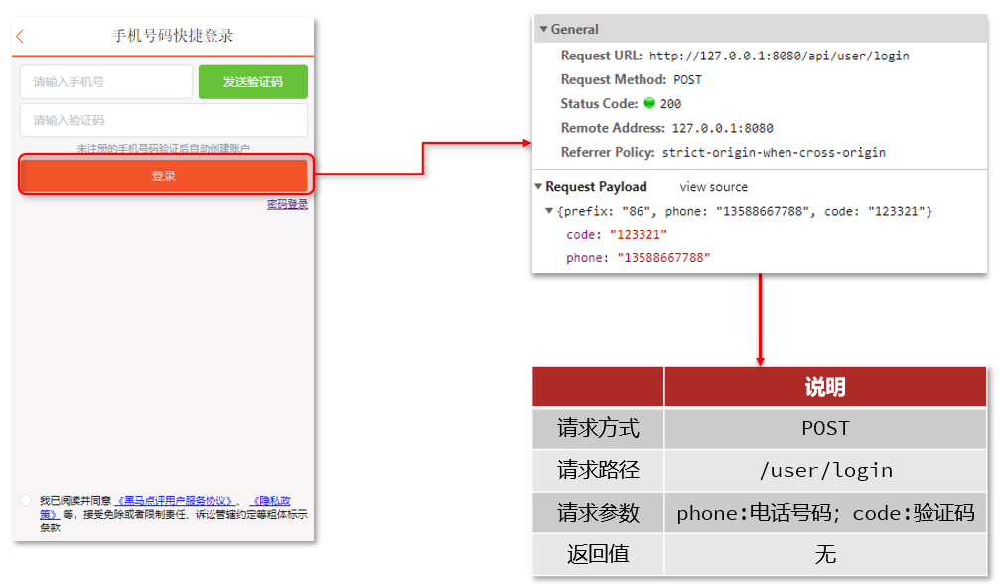

可以看到请求的路径是 user/login，参数是phone和code


```java
@Override
public Result login(LoginFormDTO loginForm, HttpSession session) {
	// 1.校验手机号
	String phone = loginForm.getPhone();
	if (RegexUtils.isPhoneInvalid(phone)) {
		// 2.如果不符合，返回错误信息
		return Result.fail("手机号格式错误！");
	}
	// 3.校验验证码
	Object cacheCode = session.getAttribute("code");
	String code = loginForm.getCode();
	if(cacheCode == null || !cacheCode.toString().equals(code)){
		//3.不一致，报错
		return Result.fail("验证码错误");
	}
	//4. 一致，根据手机号查询用户 select * from tb_user where phone = ?
	User user = query().eq("phone", phone).one();

	//5.判断用户是否存在
	if(user == null){
		//不存在，则创建
		user =  createUserWithPhone(phone);
	}
	//7.保存用户信息到session中
	session.setAttribute("user",user);

	return Result.ok();
}

private User createUserWithPhone(String phone) {
	User user = new User();
	user.setPhone(phone);
	user.setNickName(USER_NICK_NAME_PREFIX + RandomUtil.randomString(10));

	save(user);
	return user;
}
```


> 这里的写法存在问题，**假如我先用自己的获取验证码，再换别人的手机号用我的验证码登录，也可以登录**

## 4. 实现登录拦截功能

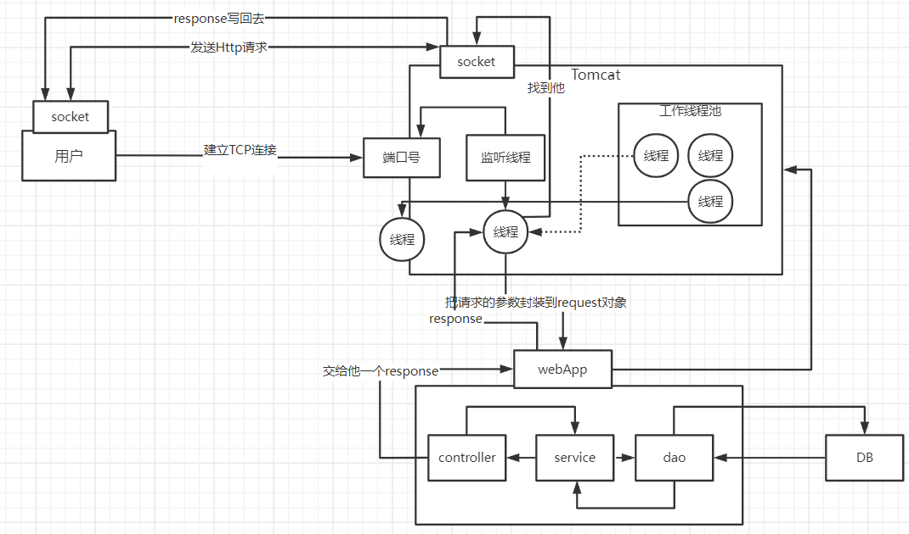

当用户发起请求时，会访问我们向tomcat注册的端口，任何程序想要运行，都需要有一个线程对当前端口号进行监听，tomcat也不例外，当监听线程知道用户想要和tomcat连接连接时，那会由监听线程创建socket连接，socket都是成对出现的，用户通过socket相互相传递数据，当tomcat端的socket接受到数据后，此时监听线程会从tomcat的线程池中取出一个线程执行用户请求，在我们的服务部署到tomcat后，线程会找到用户想要访问的工程，然后用这个线程转发到工程中的controller，service，dao中，并且访问对应的DB，在用户执行完请求后，再统一返回，再找到tomcat端的socket，再将数据写回到用户端的socket，完成请求和响应

通过以上讲解，我们可以得知 每个用户其实对应都是去找tomcat线程池中的一个线程来完成工作的， 使用完成后再进行回收，既然每个请求都是独立的，所以在每个用户去访问我们的工程时，我们可以使用threadlocal来做到线程隔离，每个线程操作自己的一份数据

### 4.1 拦截器

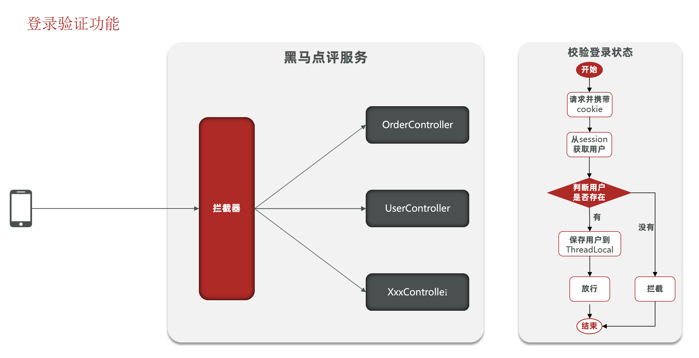

随着业务的开发，越来越多的业务都需要去校验用户的登录，我们应该考虑把用户登录验证功能的逻辑抽取到一个地方，就是SpringMVC的拦截器，它可以在请求所有Controller之前去做，用户的所有请求必须先经过拦截器，再由拦截器判断是否放行到对应的Controller。

第二个问题是，拦截器帮我们完成了对用户的校验，拿到了用户信息，那对应的Controller如何拿到用户信息呢？因此我们应该设计一个方案，将拦截器里得到的用户信息传递到Controller，在传递过程中需要保证线程安全问题。这个方案就是将用户信息保存到ThreadLocal中

> 关于ThreadLocal:
>
> ThreadLocal是一个线程域对象，每一个进入Tomcat的请求都是一个独立的线程，ThreadLocal会在当前用户线程内开辟一块独立的内存空间，保存信息到对应的ThreadLocalMap，保证每个线程互相不干扰。在ThreadLocal的源码中，无论是它的put方法还是get方法， 都是先从获得当前用户的线程，然后从线程中取出线程的成员变量map，只要线程不一样，map就不一样，所以可以通过这种方式来做到线程隔离。
>
> - 存入ThreadLocal中的主要原因
>   - （1）避免后续业务操作频繁向session域中存取数据，减少session的访问开销。
>   - （2）避免线程安全问题。


**我们不能直接把user存入，而是要保留一些不隐私的信息(UserDto),仅提供前端视图需要展示的属性，隐藏用户敏感信息然后传入Session**

修改login方法，将User转为DTO保存到session：

```java
//7.保存用户信息到session中
session.setAttribute("user", BeanUtil.copyProperties(user, UserDTO.class));
return Result.ok();
```


在utils中新建LoginInterceptor类

```java
/**
 * @author shlock
 * @description 登陆拦截器 需要实现 HandlerInterceptor 接口
 * @create 2025/4/6
 */
public class LoginInterceptor implements HandlerInterceptor {

    /**
     * 前置拦截，在Controller执行之前
     * 做登录验证校验
     */
    @Override
    public boolean preHandle(HttpServletRequest request, HttpServletResponse response, Object handler) throws Exception {
        // 1. 获取当前请求的 session
        HttpSession session = request.getSession();
        // 2. 获取 session 中保存的用户信息
        Object user = session.getAttribute("user");
        // 3. 判断用户信息是否为空，如果为空，则未登录
        if (user == null) {
            response.setStatus(401); // 401 未授权
            return false;
        }
        // 5. 存在用户信息，保存到 ThreadLocal
        UserHolder.saveUser((UserDTO) user);
        // 6. 放行
        return true;
    }

    /**
     * 在视图渲染之后，返回给用户之前
     * 业务执行完后，销毁用户信息，避免内存泄露
     */
    @Override
    public void afterCompletion(HttpServletRequest request, HttpServletResponse response, Object handler, Exception ex) throws Exception {
        // 在线程中移除用户信息，避免内存泄漏
        UserHolder.removeUser();
    }
}
```

这里UserHolder是ThreadLocal的工具类：

```java
public class UserHolder {
    private static final ThreadLocal<UserDTO> tl = new ThreadLocal<>();

    public static void saveUser(UserDTO user){
        tl.set(user);
    }

    public static UserDTO getUser(){
        return tl.get();
    }

    public static void removeUser(){
        tl.remove();
    }
}
```


### 配置拦截器：

在config文件夹下新建`MvcConfig`类

```java
/**
 * @author shlock
 * @description 拦截器配置
 * @create 2025/4/6
 */
@Configuration
public class MvcConfig implements WebMvcConfigurer {
    @Override
    public void addInterceptors(InterceptorRegistry registry) {
        // 登录拦截器
        registry.addInterceptor(new LoginInterceptor())
                .excludePathPatterns(  // 排除，也就是放行路径
                        "/shop/**",
                        "/voucher/**",
                        "/shop-type/**",
                        "/upload/**",
                        "/blog/hot",
                        "/user/code",
                        "/user/login"
                ).order(1);
    }
}
```

### 完善UserController中的user/me接口

```java
@GetMapping("/me")
public Result me(){
    // 获取当前登录的用户并返回
    UserDTO user = UserHolder.getUser();
    return Result.ok(user);
}
```

## 5. session共享问题

**Session共享问题**：当搭建多节点Tomcat服务器集群时，多台Tomcat并不共享session存储空间，当请求切换到不同tomcat服务时导致数据丢失的问题。

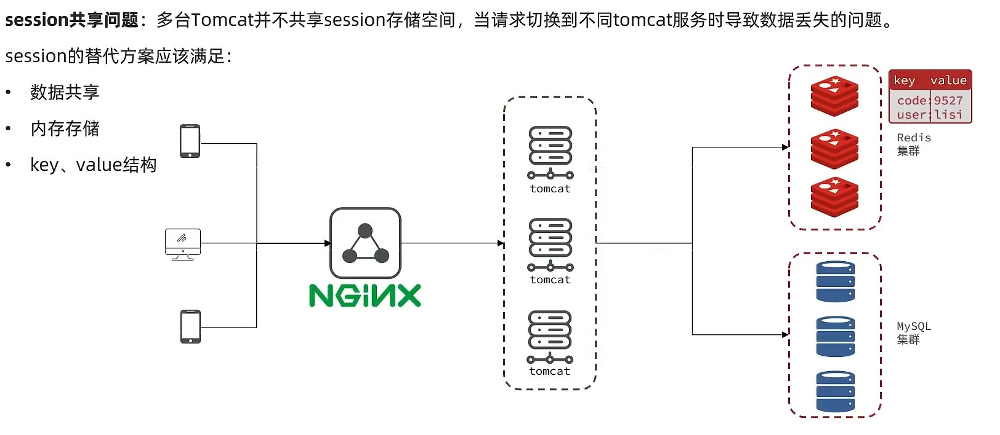

我们能如何解决这个问题呢？早期的方案是`session拷贝`，就是说虽然每个tomcat上都有不同的session，但是每当任意一台服务器的session修改时，都会同步给其他的tomcat服务器的session，这样的话，就可以实现session的共享了。


但是这种方案具有两个大问题：

1. 每台服务器中都有完整的一份session数据，服务器压力过大，`冗余备份问题`。
2. session拷贝数据时，可能会出现延迟，`数据一致性存在问题`

此时适合解决这个场景的方案需要满足三点：

1. 数据共享
2. 高并发下读写迅速
3. 存储结构为key-value

由于redis是基于内存存储，性能非常强，读写延迟基本在微秒级别。因此我们将session换成redis存储数据，redis脱离了tomcat存储数据，支持多台tomcat服务器共享数据，也就避免了session共享的问题。为了保证redis数据不丢失，后期还可以考虑搭建redis集群。

## 6. Redis代替session的业务流程

### 6.1 Key的结构

首先我们要思考一下利用redis来存储数据，那么到底使用哪种结构呢？由于存入的数据比较简单，我们可以考虑使用`String` 或者`hash` 

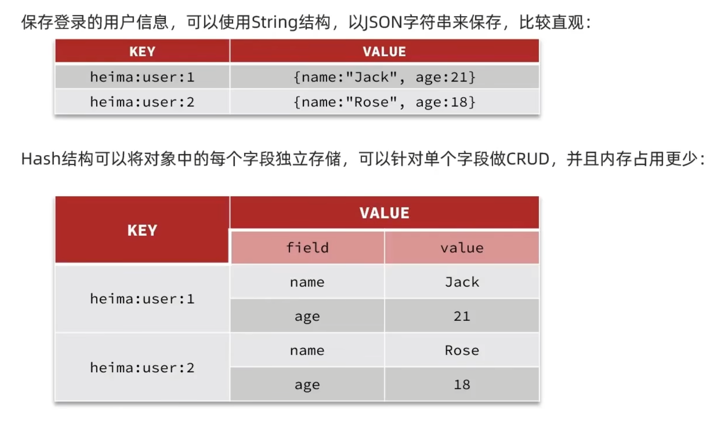

- String结构与Hash结构存储值的比较
  - String的值是将Java对象序列化为JSON字符串的形式保存，更加直观，操作也更加简单，但是 JSON 结构会有很多非必须的内存开销，比如双引号、大括号，内存占用比Hash更高。
  - Hash的值是以hash表的形式保存，通过field单独存储对象中每个属性的值，对单个字段增删改查更加灵活，hash类型存储空间占用比String类型更小。

如果不是特别在意内存，其实使用String就可以

### 6.2 Key的细节

关于key的处理，session是每个用户都有自己独立的session，因此key可以写死为code，因为每个session有不同的sessionId来保证唯一性。但是redis的key是共享的，就不能使用硬编码的key了。

在设计这个key的时候，需要满足两点：

​	1、key要具有唯一性

​	2、key要方便携带

如果我们采用phone手机号作为key来存储当然是可以的，但是如果把这样的敏感数据存储到redis中并且从页面中带过来毕竟不太合适。所以我们在后台生成一个随机串token，tomcat并不会像sessionId那样把token自动写到客户端浏览器中，因此我们需要手动的把token返回给客户端，客户端保存`token`作为`登录凭证`，之后客户端携带着token来发送请求，后端服务器验证token后就可以基于token从redis中获取数据。

### 6.3 整体访问流程

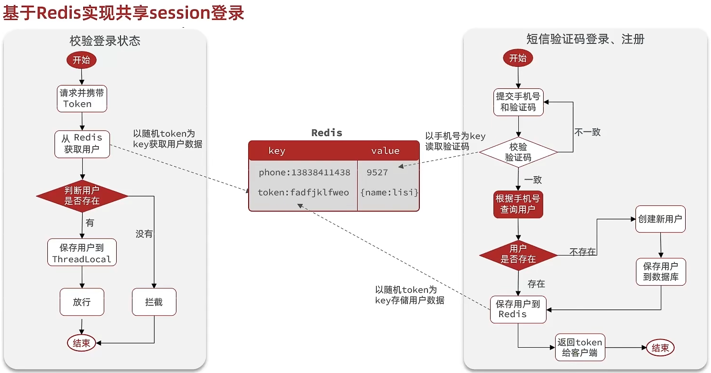

当注册完成后，用户去登录会去校验用户提交的手机号和验证码是否一致，如果一致，则根据手机号查询用户信息，不存在则新建，最后将用户数据保存到redis，并且生成token作为redis的key，当我们校验用户是否登录时，会去携带着token进行访问，从redis中取出token对应的value，判断是否存在这个数据，如果没有则拦截，如果存在则将其保存到threadLocal中，并且放行。

## 7. 基于Redis实现短信登录

- UserServiceImpl

```java
@Resource
private StringRedisTemplate stringRedisTemplate;

@Override
public Result sendCode(String phone, HttpSession session) {
    // 1.校验手机号
    if (RegexUtils.isPhoneInvalid(phone)) {
        // 2.如果不符合，返回错误信息
        return Result.fail("手机号格式错误！");
    }
    // 3.符合，生成验证码
    String code = RandomUtil.randomNumbers(6);

    // 4.保存验证码到 redis
    stringRedisTemplate.opsForValue().set(LOGIN_CODE_KEY + phone, code, LOGIN_CODE_TTL, TimeUnit.MINUTES);
    // 5.发送验证码
    log.info("验证码为: " + code);
    log.debug("发送短信验证码成功，验证码：{}", code);
    // 返回ok
    return Result.ok();
}

@Override
public Result login(LoginFormDTO loginForm, HttpSession session) {
    // 1.校验手机号
    String phone = loginForm.getPhone();
    if (RegexUtils.isPhoneInvalid(phone)) {
        // 2.如果不符合，返回错误信息
        return Result.fail("手机号格式错误！");
    }
    // 3.从redis获取验证码并校验
    String cacheCode = stringRedisTemplate.opsForValue().get(LOGIN_CODE_KEY + phone);
    String code = loginForm.getCode();
    if(cacheCode == null || !cacheCode.equals(code)){
        //3.不一致，报错
        return Result.fail("验证码错误");
    }
    //4. 一致，根据手机号查询用户 select * from tb_user where phone = ?
    User user = query().eq("phone", phone).one();

    //5.判断用户是否存在
    if(user == null){
        // 6.不存在，创建新用户并保存
        user =  createUserWithPhone(phone);
    }
    // 7.保存用户信息到 redis中
    // 7.1.随机生成token，作为登录令牌
    String token = UUID.randomUUID().toString(true);
    // 7.2.将User对象转为HashMap存储
    UserDTO userDTO = BeanUtil.copyProperties(user, UserDTO.class);
    Map<String, Object> userMap = BeanUtil.beanToMap(userDTO, new HashMap<>(),
                                                     CopyOptions.create()
                                                     .setIgnoreNullValue(true)  // 忽略为空的属性
                                                     // 将每个字段值转换为字符串形式
                                                     .setFieldValueEditor((fieldName, fieldValue) -> fieldValue.toString()));
    // 7.3.存储
    String tokenKey = LOGIN_USER_KEY + token;
    stringRedisTemplate.opsForHash().putAll(tokenKey, userMap);
    // 7.4.设置token有效期
    stringRedisTemplate.expire(tokenKey, LOGIN_USER_TTL, TimeUnit.MINUTES);

    // 8.返回token
    return Result.ok(token);
}
```

**MvcConfig注入stringRedisTemplate,然后传给LoginInterceptor,因为LoginInterceptor不是bean，是我们手动new出来的，不能用spring注入其他bean**

```java
@Configuration
public class MvcConfig implements WebMvcConfigurer {

    @Resource
    private StringRedisTemplate stringRedisTemplate;

    @Override
    public void addInterceptors(InterceptorRegistry registry) {
        registry.addInterceptor(new LoginInterceptor(stringRedisTemplate))
                .excludePathPatterns(
                        "/user/code",
                        "/user/login",
                        "/blog/hot",
                        "/shop/**",
                        "/shop-type/**",
                        "/upload/**",
                        "/voucher/**"
                );
    }
}

```

拦截器：

```java
public class LoginInterceptor implements HandlerInterceptor {

    private final StringRedisTemplate stringRedisTemplate;

    public LoginInterceptor(StringRedisTemplate stringRedisTemplate) {
        this.stringRedisTemplate = stringRedisTemplate;
    }

    /**
     * 前置拦截，在Controller执行之前
     * 做登录验证校验
     */
    @Override
    public boolean preHandle(HttpServletRequest request, HttpServletResponse response, Object handler) throws Exception {
        //1.获取请求头中的token
        String token = request.getHeader("authorization");
        if (StrUtil.isBlank(token)){
            //不存在，拦截 设置响应状态吗为401（未授权）
            response.setStatus(401);
            return false;
        }
        // 2. 获取 session 中保存的用户信息
        //2.基于token获取redis中用户
        String key=RedisConstants.LOGIN_USER_KEY + token;
        Map<Object, Object> userMap = stringRedisTemplate.opsForHash().entries(key);
        //3.判断用户是否存在
        if (userMap.isEmpty()){
            //4.不存在则拦截，设置响应状态吗为401（未授权）
            response.setStatus(401);
            return false;
        }
        //5.将查询到的Hash数据转化为UserDTO对象
        UserDTO userDTO=new UserDTO();
        BeanUtil.fillBeanWithMap(userMap,userDTO, false);
        //6.保存用户信息到ThreadLocal
        UserHolder.saveUser(userDTO);
        //7.更新token的有效时间，只要用户还在访问我们就需要更新token的存活时间
        stringRedisTemplate.expire(key, RedisConstants.LOGIN_USER_TTL, TimeUnit.SECONDS);
        //8.放行
        return true;
    }

    /**
     * 在视图渲染之后，返回给用户之前
     * 业务执行完后，销毁用户信息，避免内存泄露
     */
    @Override
    public void afterCompletion(HttpServletRequest request, HttpServletResponse response, Object handler, Exception ex) throws Exception {
        // 在线程中移除用户信息，避免内存泄漏
        UserHolder.removeUser();
    }
}
```


## 8. 解决状态登录刷新问题

### 8.1 初始方案问题分析

上面使用的拦截器确实可以使用对应路径的拦截，同时刷新登录token令牌的存活时间，但是现在这个拦截器他只是拦截需要被拦截的路径，假设当前用户访问了一些不需要拦截的路径，那么这个拦截器就不会生效，所以此时令牌刷新的动作实际上就不会执行，所以这个方案他是存在问题的。

### 8.2 优化登陆拦截器

>  可以添加一个拦截器，在第一个拦截器中拦截所有的路径，把第二个拦截器做的事情放入到第一个拦截器中，同时刷新令牌，因为第一个拦截器有了threadLocal的数据，所以此时第二个拦截器只需要判断拦截器中的user对象是否存在即可

**单独配置一个拦截器用户刷新Redis中的token**：在基于Session实现短信验证码登录时，我们只配置了一个拦截器，这里需要另外再配置一个拦截器专门用户刷新存入Redis中的token。因为我们现在改用Redis了，为了防止用户在操作网站时突然由于Redis中的token过期，导致直接退出网站，严重影响用户体验。

那为什么不把刷新的操作放到一个拦截器中呢？因为之前的那个拦截器只是用来拦截一些需要进行登录校验的请求，对于哪些不需要登录校验的请求是不会走拦截器的，刷新操作显然是要针对所有请求比较合理，所以单独创建一个拦截器拦截一切请求，对于已登录的用户刷新Redis中的token，对于未登录的用户请求，不需要刷新Redis中的token，直接放行交给第二个登录拦截器去做未授权拦截，完成整体刷新功能。

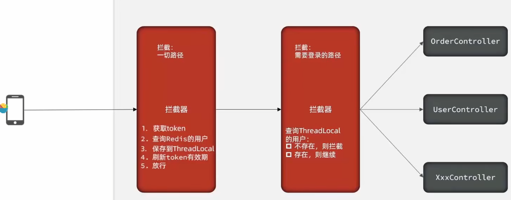


刷新token的拦截器：

无论token是否有效都要放行，放给第二个拦截器判断

```java
public class RefreshTokenInterceptor implements HandlerInterceptor {

    private StringRedisTemplate stringRedisTemplate;

    public RefreshTokenInterceptor(StringRedisTemplate stringRedisTemplate) {
        this.stringRedisTemplate = stringRedisTemplate;
    }

    @Override
    public boolean preHandle(HttpServletRequest request, HttpServletResponse response, Object handler) throws Exception {
        // 1.获取请求头中的token
        String token = request.getHeader("authorization");
        if (StrUtil.isBlank(token)) {
            return true;
        }
        // 2.基于TOKEN获取redis中的用户
        String key  = LOGIN_USER_KEY + token;
        Map<Object, Object> userMap = stringRedisTemplate.opsForHash().entries(key);
        // 3.判断用户是否存在
        if (userMap.isEmpty()) {
            return true;  // 这里要注意，不存在也要返回true，交给后面的拦截器拦截
        }
        // 5.将查询到的hash数据转为UserDTO
        UserDTO userDTO = BeanUtil.fillBeanWithMap(userMap, new UserDTO(), false);
        // 6.存在，保存用户信息到 ThreadLocal
        UserHolder.saveUser(userDTO);
        // 7.刷新token有效期
        stringRedisTemplate.expire(key, LOGIN_USER_TTL, TimeUnit.MINUTES);
        // 8.放行
        return true;
    }

    @Override
    public void afterCompletion(HttpServletRequest request, HttpServletResponse response, Object handler, Exception ex) throws Exception {
        // 移除用户
        UserHolder.removeUser();
    }
}
```

登陆拦截器：

```java
public class LoginInterceptor implements HandlerInterceptor {

    @Override
    public boolean preHandle(HttpServletRequest request, HttpServletResponse response, Object handler) throws Exception {
        // 1.判断是否需要拦截（ThreadLocal中是否有用户）
        if (UserHolder.getUser() == null) {
            // 没有，需要拦截，设置状态码
            response.setStatus(401);
            // 拦截
            return false;
        }
        // 有用户，则放行
        return true;
    }
}
```


配置：

```java
@Configuration
public class MvcConfig implements WebMvcConfigurer {

    @Resource
    private StringRedisTemplate stringRedisTemplate;

    @Override
    public void addInterceptors(InterceptorRegistry registry) {
        // 登录拦截器
        registry.addInterceptor(new LoginInterceptor())
                .excludePathPatterns(  // 排除，也就是放行路径
                        "/shop/**",
                        "/voucher/**",
                        "/shop-type/**",
                        "/upload/**",
                        "/blog/hot",
                        "/user/code",
                        "/user/login"
                ).order(1);
        // token刷新的拦截器
        registry.addInterceptor(new RefreshTokenInterceptor(stringRedisTemplate)).addPathPatterns("/**").order(0);
    }
}
```

通过`.order(0);`设置拦截器的顺序

刷新页面后，redis中TTL的值会更新：

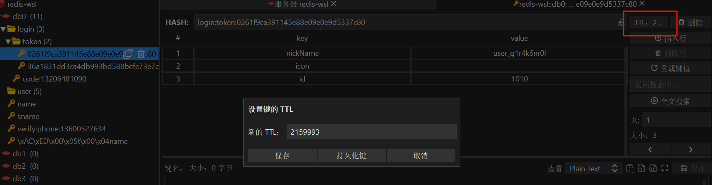
